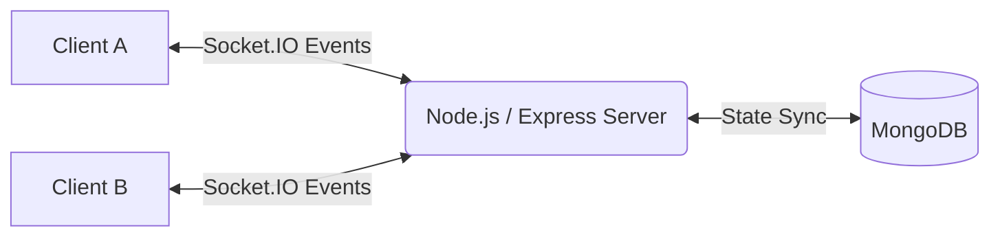
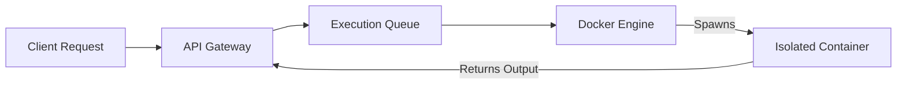
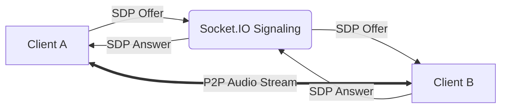

# Code-CoLAB
> A high-concurrency real-time collaborative environment designed to transform passive computer lab sessions into active, peer-driven learning experiences.

## Problem Statement
Traditional computer science labs suffer from a systemic pedagogical flaw: **passive learning**. Students often just copy-paste the program instead of learning the working(to complete their hand written lab journal the biggest 🚩), leading to:
- Lack of meaningful peer collaboration
- Poor engagement during practical exercises
- Blind copy-pasting of code without comprehension
- Difficulty conducting effective remote or hybrid programming sessions

Without real-time discussion and shared execution, practical labs fail to simulate the collaborative nature of modern software engineering.

## Solution Overview
<div align="center">
  <a href="https://youtu.be/lQFppTKu4xY">
    
  </a>
</div>
Code-CoLAB solves the pedagogical issue of passive learning by enforcing a **synchronized, collaborative workspace**. It is not just a text editor; it is a real-time systems project engineered to facilitate active pair-programming. 

By integrating bidirectional state synchronization, isolated Docker-based execution, and peer-to-peer WebRTC voice communication, Code-CoLAB bridges the gap between isolated coding and true collaborative engineering.

## Core Features
- **Real-Time Collaborative Editor:** Sub-millisecond code synchronization across multiple clients.
- **Docker-Based Execution Engine:** Unified, reproducible runtime environments eliminating the "works on my machine" problem.
- **Multi-Language Execution:** Native support for Python, Java, C etc inside secure containers.
- **WebRTC Voice Communication:** High-fidelity, low-latency peer-to-peer audio for immediate architectural discussions.
- **Assignment Workflow:** Structured environments for educators to distribute, monitor, and review team-based coding tasks.
- **Anti Copy-Paste Protections:**To ensure active typing and genuine code construction during assignments(ok they can see and write, that's fine atleast student will know what they are doing instead of quick c-p)
- **Sandbox Protection:** Hardened execution isolation preventing malicious code and infinite loops from crashing the host server.

## System Architecture

The architecture is designed for high concurrency and strict isolation.

### Real-Time Collaboration Flow
Code-CoLAB utilizes **Socket.IO** for low-latency bidirectional communication over WebSockets. 

*Why Socket.IO?* It provides robust fallback polling and automatic reconnection, critical for maintaining synchronized editor states (via CodeMirror) across volatile network conditions.

### Docker Execution Pipeline
To safely execute untrusted student code, Code-CoLAB spins up ephemeral Docker containers.

*Why Docker Sandboxing?* Running arbitrary student code on a host server is a massive security risk. Docker ensures strict resource limits (memory, CPU, execution time) preventing infinite loops and malicious scripts from compromising the platform.

### WebRTC Voice Collaboration

*Why WebRTC?* P2P audio reduces server bandwidth overhead to zero once the connection is established. It keeps students engaged in verbal problem-solving without requiring third-party VoIP software.

## Tech Stack

| Layer | Technologies |
| :--- | :--- |
| **Frontend** | React, CodeMirror(v5), Socket.IO Client |
| **Backend** | Node.js, Express.js, MongoDB, Mongoose |
| **Realtime** | Socket.IO (Signaling & Sync), WebRTC (Voice) |
| **Execution Engine** | Docker, Python Runtime, Java Runtime |

## Security & Sandbox Measures
- **Execution Isolation:** Every code execution spawns a fresh, ephemeral Docker container without network access.
- **Infinite Loop Handling:** Strict CPU time limits and `timeout` commands kill runaway processes before they consume host resources.
- **Resource Quotas:** Memory limits are enforced at the Docker daemon level to prevent out-of-memory (OOM) crashes.

## Local Setup

### Prerequisites
- Node.js (v18+)
- MongoDB (Local or Atlas)
- **Docker Desktop / Docker Engine MUST be running** for the code execution engine to function.

### Environment Variables
Create a `.env` file in the `backend` directory:
```env
PORT=5000
MONGODB_URI=your_mongodb_connection_string
```

### Installation & Running

1. **Clone the repository:**
   ```bash
   git clone https://github.com/yourusername/Code-CoLAB.git
   cd Code-CoLAB
   ```

2. **Backend Setup:**
   ```bash
   cd backend
   npm install
   npm run dev
   ```

3. **Frontend Setup:**
   ```bash
   cd frontend
   npm install
   npm start
   ```

## Future Enhancements
- Video streaming integration via WebRTC.
- Advanced static code analysis and automated grading for assignments.
- Expanded language support (C++, Go, Rust) via optimized Docker images.

## Conclusion
Code-CoLAB is more than just a collaborative code editor. By addressing the core educational challenges of passive learning and student isolation, it provides a robust, real-time environment where active peer-studying and synchronized problem solving become the default mode of learning.
